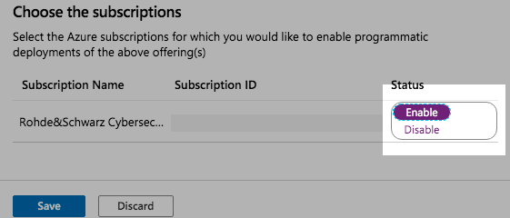

Microsoft Azure
===============

* 1 [Microsoft Azure recommendations and specific behaviours](#microsoft-azure-recommendations-and-specific-behaviours)
* 2 [Authentication in Azure](#authentication-in-azure)
* 3 [Usage](#usage)
* 4 [Enable programmatic deployments of our products](#enable-programmatic-deployments-of-our-products)

Microsoft Azure recommendations and specific behaviours
-------------------------------------------------------

| :warning: Please read this carefully before running our service in production on Microsoft Azure.|
|:-------------------------------------------------------------------------------------------------|

We recommend using a network (level 4) load balancer to allow direct TCP connections to the WAF instances.

Azure health checks (**azurerm_lb_probe**) cannot provide a **Host** HTTP header, reverse proxies must not block unknown hosts.

Authentication in Azure
-----------------------

Setup an authentication strategy like explained here: https://www.terraform.io/docs/providers/azurerm/index.html.

Usage
-----

Terraform modules for Microsoft Azure and some examples are provided on [github.com/Rohde-Schwarz](https://github.com/Rohde-Schwarz/r-s-waf-extra/tree/master/terraform)

Modules are located in:

* **modules/azure/autoscaled**: Module to deploy an autoscaled R&S®Web Application Firewall cluster.
* **modules/azure/basic**: Module to deploy a basic R&S®Web Application Firewall cluster.
* **modules/azure/lb**: Basic implementation of Azure Loadbalancer for an R&S®Web Application Firewall cluster (basic or autoscaled).
* **modules/azure/policy**: Basic implementation of autoscaling policies for an autoscaled R&S®Web Application Firewall cluster.

Examples for Azure can be found in:

* **examples/azure_basic**: shows how we deploy a basic R&S®Web Application Firewall cluster with an Azure loadbalancer.
* **examples/azure_autoscaled**: shows how we deploy an autoscaled R&S®Web Application Firewall cluster with an Azure loadbalancer and some autoscaling capabilities.

In the main configuration file, **main.tf**, you can edit variables like Azure region and prefix of your future instances. You can also find every configuration needed to deploy your instances.

| :warning: Don't forget to edit the template to match your configuration before using it.|
|:----------------------------------------------------------------------------------------|

Enable programmatic deployments of our products
-----------------------------------------------

In Microsoft Azure Portal, go to the Marketplace and search **R&S®Web Application Firewall - Enterprise Edition**.

Select the software plan **Web Application Firewall Enterprise Edition (BYOL)**, and click on **Want to deploy programmatically? Get started**.

Then, select **enable** for your subscription, and **Save**.

Do the same operations with the software plan **Web Application Firewall Enterprise Edition (PAYG)**.
